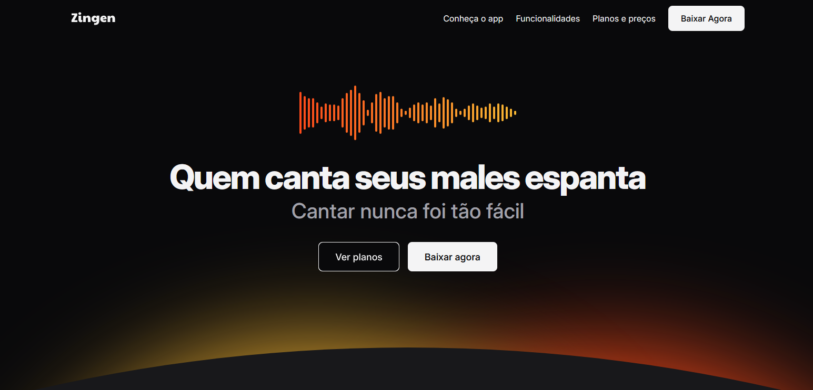

# Zingen



This project is a **responsive landing page** built as a personal challenge to recreate a [Figma design](https://www.figma.com/community/file/1371886246180677672) using only HTML and CSS. The main goal was to practice web layout skills, CSS organization, and responsive techniques—transforming a Figma prototype into a functional, adaptable web page.

## 🎯 About the Challenge

- **Objective:** Recreate a provided Figma landing page as closely as possible.
- **Focus:** Responsive design, semantic HTML, and clean CSS structure.
- **Learning:** Improved my understanding of layout systems (Flexbox, Grid), media queries, and component-based CSS.

## 🚀 Highlights

- **Fully responsive:** Works on desktops, tablets, and mobile devices.
- **CSS organization:** Modular styles for easy maintenance.
- **No frameworks:** Pure HTML and CSS, no JavaScript or build tools.

## 📁 Project Structure

```
index.html
assets/
  icons/
  images/
styles/
  about.css
  buttons.css
  cards.css
  download.css
  features.css
  footer.css
  global.css
  header.css
  hero.css
  index.css
  pricing.css
  sections.css
  social.css
  utility.css
```

## 📄 License

This project is for educational and demonstration purposes.

---

<p align="center">Made with ❤️ by <a href="https://www.linkedin.com/in/gustavo-santos-744549234/">Gustavo Arruda</a></p>
